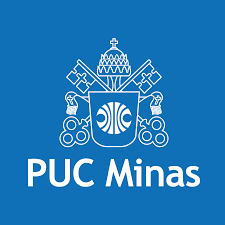

# 🎓 Jornada Acadêmica em Ciência da Computação

  
  
  ### **Pontifícia Universidade Católica de Minas Gerais**
  
  *Documentando cada descoberta, cada linha de código, cada momento de aprendizado*

---

### 📚 Sobre este Repositório

Bem-vindo(a) à minha jornada acadêmica! Este espaço é onde compartilho todo o conhecimento adquirido durante o curso de **Ciência da Computação** na PUC Minas. Aqui você encontrará desde os primeiros "Hello World" até projetos mais complexos, sempre com o objetivo de documentar o processo de aprendizado.

---

### Grade curricular

> Legenda: ✅ Concluído | 🟡 Em Progresso | 🔴 Não Iniciado

1️⃣ Primeiro Período

| Disciplinas                              | Status       | Professores |
|------------------------------------------|----------------- |-------------|
| Algoritmo e Estrutura de Dados 1     | 🟡 Em Progresso | Felipe Domingos da Cunha
| Cálculo 1                            | ✅ Concluído    | Carina Pinheiro Soares
| Desenvolvimento de Interfaces Web    | ✅ Concluído    | Rommel Vieira Carneiro
| Laboratório de Iniciação à Computação| ✅ Concluído    | João Paulo Aramuni
| Trabalho Interdisciplinar 1: Front-End | ✅ Concluído  | Ilo Rivero
| Introdução à Computação             | ✅ Concluído    | Carlos Alberto Marques Pietrobon
| Filosofia: Razão e Modernidade       | ✅ Concluído    | Maria Dulce Reis

2️⃣ Segundo Período

| Disciplinas                              | Status       | Professores |
|------------------------------------------|----------------- |-------------|
| Algoritmo e Estrutura de Dados 2     | 🔴 Não iniciado |
| Arquitetura de Computadores 1                            | 🟡 Em Progresso    | Theldo Cruz Franqueira
| Cultura Religiosa: Fênomeno Religioso    | 🟡 Em Progresso    | Rodrigo Coppe Caldeira
| Engenharia de Software| 🔴 Não iniciado    |
| Trabalho Interdisciplinar 2: Back-End | 🔴 Não iniciado  |
| Optativa 1              | 🔴 Não iniciado    |

3️⃣ Terceiro Período

| Disciplinas                              | Status       | Professores |
|------------------------------------------|----------------- |-------------|
| Algoritmo e Estrutura de Dados 3     | 🔴 Não iniciado |
| Arquitetura de Computadores 2                            | 🔴 Não iniciado    |
| Banco de Dados    | 🔴 Não iniciado    |
| Cálculo 2| 🟡 Em Progresso    | Roney Rachide Nunes
| Linguagens de Programação | 🔴 Não iniciado  |
| Trabalho Interdisciplinar 3: Pesquisa Aplicada              | 🔴 Não iniciado    |

4️⃣ Quarto Período

| Disciplinas                              | Status       | Professores |
|------------------------------------------|----------------- |-------------|
| **Estatística e Probabilidade**                             | 🔴 Não iniciado |
| **Inteligência Artificial**                                 | 🔴 Não iniciado |
| **Laboratório de Desenvolvimento para Dispositivos Móveis** | 🔴 Não iniciado |
| **Modelagem e Avaliação de Desempenho**                     | 🔴 Não iniciado |
| **Optativa II**                                             | 🔴 Não iniciado |
| **Teoria dos Grafos e Computabilidade**                     | 🔴 Não iniciado |
| **Trabalho Interdisciplinar IV: Aplicações Móveis**         | 🔴 Não iniciado |

5️⃣ Quinto Período

| Disciplinas                              | Status       | Professores |
|------------------------------------------|----------------- |-------------|
| **Arquitetura de Computadores III**                      | 🔴 Não iniciado |
| **Engenharia de Software II**                            | 🔴 Não iniciado |
| **Optativa III**                                         | 🔴 Não iniciado |
| **Projeto e Análise de Algoritmos**                      | 🔴 Não iniciado |
| **Redes de Computadores I**                              | 🔴 Não iniciado |
| **Sistemas Operacionais**                                | 🔴 Não iniciado |
| **Trabalho Interdisciplinar V: Sistemas Computacionais** | 🔴 Não iniciado |

6️⃣ Sexto Período

| Disciplinas                              | Status       | Professores |
|------------------------------------------|----------------- |-------------|
| **Computação Distribuída**                                          | 🔴 Não iniciado |
| **Computação Paralela**                                             | 🔴 Não iniciado |
| **Cultura Religiosa: Pessoa e Sociedade**                           | 🔴 Não iniciado |
| **Fundamentos Teóricos da Computação**                              | 🔴 Não iniciado |
| **Geometria Analítica e Álgebra Linear**                            | 🔴 Não iniciado |
| **Processamento e Análise de Imagens**                              | 🔴 Não iniciado |
| **Trabalho Interdisciplinar VI: Sistemas Paralelos e Distribuídos** | 🔴 Não iniciado |

7️⃣ Sétimo Período

| Disciplinas                              | Status       | Professores |
|------------------------------------------|----------------- |-------------|
| **Compiladores**                     | 🔴 Não iniciado |
| **Computação Gráfica**               | 🔴 Não iniciado |
| **Filosofia: Antropologia e Ética**  | 🔴 Não iniciado |
| **Redes de Computadores II**         | 🔴 Não iniciado |
| **Tópicos em Computação I**          | 🔴 Não iniciado |
| **Tópicos em Computação II**         | 🔴 Não iniciado |
| **Trabalho de Conclusão de Curso I** | 🔴 Não iniciado |

8️⃣ Oitavo Período

| Disciplinas                              | Status       | Professores |
|------------------------------------------|----------------- |-------------|
| **Cibersegurança e Ethical Hacking**  | 🔴 Não iniciado |
| **Computadores e Sociedade**          | 🔴 Não iniciado |
| **Optativa IV**                       | 🔴 Não iniciado |
| **Otimização de Sistemas**            | 🔴 Não iniciado |
| **Segurança e Auditoria de Sistemas** | 🔴 Não iniciado |
| **Tópicos em Computação III**         | 🔴 Não iniciado |
| **Tópicos em Computação IV**          | 🔴 Não iniciado |
| **Trabalho de Conclusão de Curso II** | 🔴 Não iniciado |

---

## 📊 Dashboard Acadêmico

### 🏆 Progresso Geral do Curso

## 👨‍💻 Autor

`João Pedro Sales de Deus`

