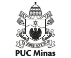

# Ciência da Computação - Puc Minas

## Seja muito bem-vindo(a) ao meu repositório de faculdade. Nesse canal, estarei publicando o que estou aprendendo/estudando durante a minha ida à faculdade. 

| Nome do Projeto | Linguagem | Status      | Última Atualização |
|----------------|-----------|------------|------------------|
| Projeto 1      | C         | Em progresso | 20/08/2025       |
| Projeto 2      | Python    | Concluído   | 18/08/2025       |
| Projeto 3      | Java      | Em planejamento | 15/08/2025    |
